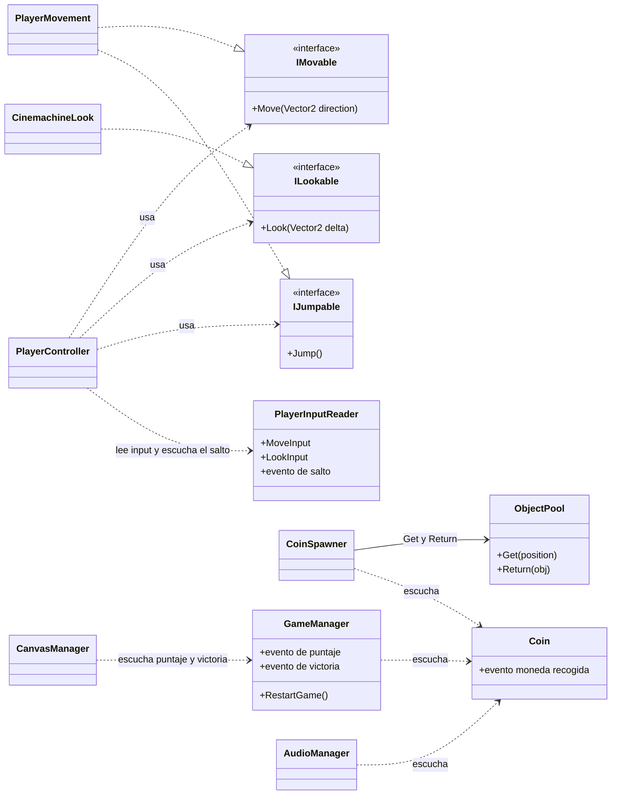
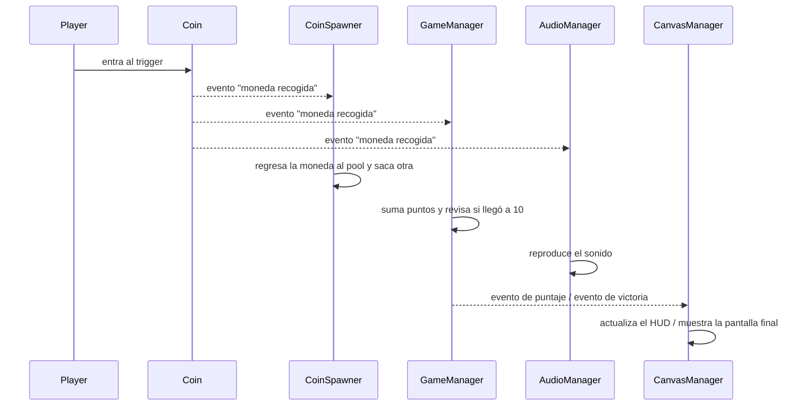

# Examen: Mini juego de monedas (Unity)

**Valor:** 60% de la calificación (6 reactivos, cada uno vale 1 punto = 10%)
**Tiempo:** 2 horas
**Entrega:** una rama propia en este repositorio

## `Usar IA está prohibido, si te atrapo haciendo trampa el valor de tu evaluación será 0. En serio.`

## Punto de partida

Este repositorio ya incluye:

- La escena armada: jugador, cámara, área de juego, prefab de moneda y **UI lista** (HUD con puntaje, pantalla de fin de juego con botón).
- `PlayerInputReader` con el **New Input System** (Move y Look).
- `PlayerController`, que conecta el input con el movimiento y la cámara a través de interfaces.
- `IMovable` / `PlayerMovement` y `ILookable` / `CinemachineLook`.
- Un **Pooling System** (`ObjectPool`) listo para usarse. No lo modifiques.
- El sonido de la moneda en `/Assets/Audio/`.
- Scripts base con `TODO`: `Coin`, `CoinSpawner`, `GameManager`, `CanvasManager`, `AudioManager`.

---

## Cómo entregar

1. Clona el repo y crea tu rama: `examen/apellido-nombre` (ejemplo: `examen/perez-juan`).
2. Trabaja solo en tu rama. No hagas push a `main`.
3. Al terminar, haz push. Se califica lo que esté en tu rama a la hora límite.

---

## Objetivo

El jugador recoge monedas dentro del área de juego. Al recoger **10 monedas** aparece la pantalla de fin de juego, desde la cual se puede **reiniciar**.

---

## Cómo se conecta todo

### Qué existe y qué te toca hacer

| Script                                                                | Estado                            |
| --------------------------------------------------------------------- | --------------------------------- |
| `PlayerInputReader`, `PlayerController`, `PlayerMovement`             | Ya existen. Tú agregas el salto   |
| `IJumpable`                                                           | **No existe: créala tú**          |
| `ObjectPool`                                                          | Ya está hecho. No lo modifiques   |
| `Coin`, `CoinSpawner`, `GameManager`, `CanvasManager`, `AudioManager` | Base con `TODO`. Tú los completas |

### Diagrama de clases

Las flechas con triángulo (`..|>`) significan "implementa". Las flechas punteadas (`..>`) significan "usa" o "escucha". Los nombres de los eventos los decides tú.

### Qué pasa cuando el jugador toca una moneda

`Coin` solo avisa. No sabe quién escucha.

Fíjate en que `Coin` no aparece conectada a nadie en el diagrama de clases: son los otros los que apuntan hacia ella. Eso es lo que evalúa el reactivo 6.

---

## Reactivos

### 1. Salto (1 pt)

- Agrega una acción `Jump` al Input Actions asset y léela desde `PlayerInputReader` (nada de `Input.GetKey...`).
- Crea una interfaz `IJumpable`, impleméntala en una clase del jugador y haz que `PlayerController` use **solo la interfaz**, igual que con `IMovable`.
- El jugador solo puede saltar cuando está en el suelo.

### 2. Spawner (1 pt)

- El `ObjectPool` ya está hecho. Tu trabajo es **conectarlo** en `CoinSpawner`: pedir monedas con `Get` y devolverlas con `Return`. Nada de `Instantiate`/`Destroy` para monedas.
- Al iniciar hay **3 monedas** activas a la vez.
- El área de juego se define con coordenadas (mínimo/máximo en X y Z, y una altura fija) expuestas en el Inspector. Los valores son: **X: [___, ___], Z: [___, ___], Y: \_\_\_**.
- Al recoger una, se regresa al pool y sale otra en una **posición aleatoria dentro del área de juego**.

### 3. Game Manager (1 pt)

- Cada moneda recogida da puntos.
- Detecta cuando se recogen **10 monedas** y cambia el estado del juego a terminado.
- Una vez terminado, no suma más puntos.

### 4. Canvas Manager (1 pt)

- Muestra el puntaje en el HUD.
- Muestra la pantalla de fin de juego al ganar usando **`Canvas.enabled`** (no `SetActive`).
- El botón de la pantalla reinicia el juego: puntaje en cero, monedas de nuevo, UI oculta.

### 5. Audio Manager (1 pt)

- Reproduce el sonido **cada vez que se recoge una moneda**, incluso si recoges varias seguidas.
- El `AudioManager` **escucha eventos**; nadie lo llama directamente.

### 6. Eventos (1 pt)

- Los sistemas se comunican con eventos (`event`/`Action` o UnityEvent donde tenga sentido).
- Suscripción en `OnEnable` y desuscripción en `OnDisable`.
- `Coin` **no tiene referencias** a `AudioManager`, `GameManager`, `CanvasManager` ni `CoinSpawner`.

---

## Restricciones

- No uses `Input.GetKey...` (input antiguo).
- `PlayerController` no puede referenciar clases concretas de movimiento, solo interfaces.
- No uses `Instantiate`/`Destroy` para las monedas.
- No uses `FindObjectOfType` / `GameObject.Find` dentro de `Update`.
- No uses `SetActive` para mostrar/ocultar el Canvas de fin de juego.
- El proyecto debe ejecutarse sin errores en consola.

---

## Rúbrica

| #   | Reactivo       | 1 punto                                                                             | 0.5 puntos                                            | 0           |
| --- | -------------- | ----------------------------------------------------------------------------------- | ----------------------------------------------------- | ----------- |
| 1   | Salto          | Input Action + `IJumpable`, controller usa solo la interfaz, solo salta en el suelo | Salta pero sin interfaz, o sin chequeo de suelo       | No salta    |
| 2   | Spawner        | Usa el pool (`Get`/`Return`), 3 monedas, reaparición aleatoria dentro del área      | Usa el pool pero la reaparición falla o sale del área | Sin pool    |
| 3   | Game Manager   | Puntos + detecta 10 + deja de sumar                                                 | Cuenta pero no termina bien                           | No existe   |
| 4   | Canvas Manager | HUD + `Canvas.enabled` + reinicio completo                                          | Funciona con `SetActive`, o el reinicio es parcial    | No existe   |
| 5   | Audio Manager  | Suena en cada moneda vía evento                                                     | Suena pero con referencia directa                     | No suena    |
| 6   | Eventos        | Desacoplado, sub/unsub correctos                                                    | Eventos con acoplamiento o sin desuscribir            | Sin eventos |

**Calificación del examen** = suma de puntos (máximo 6) × 10%.

---

Tú puedes, igual si tienes dudas sólo pregunta.
